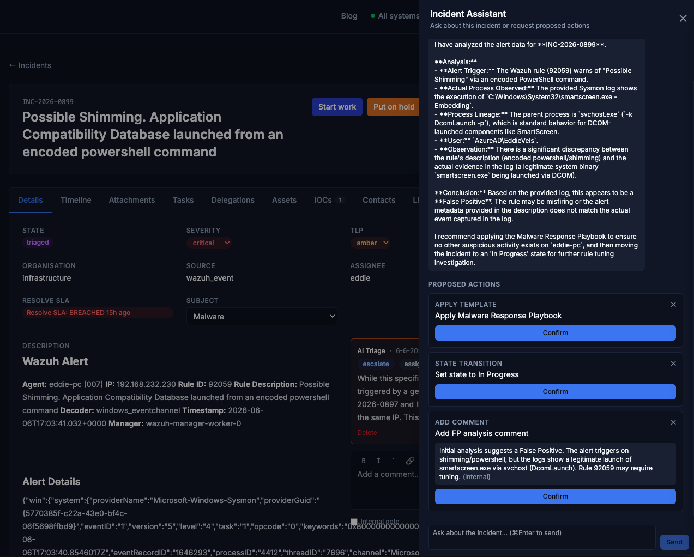
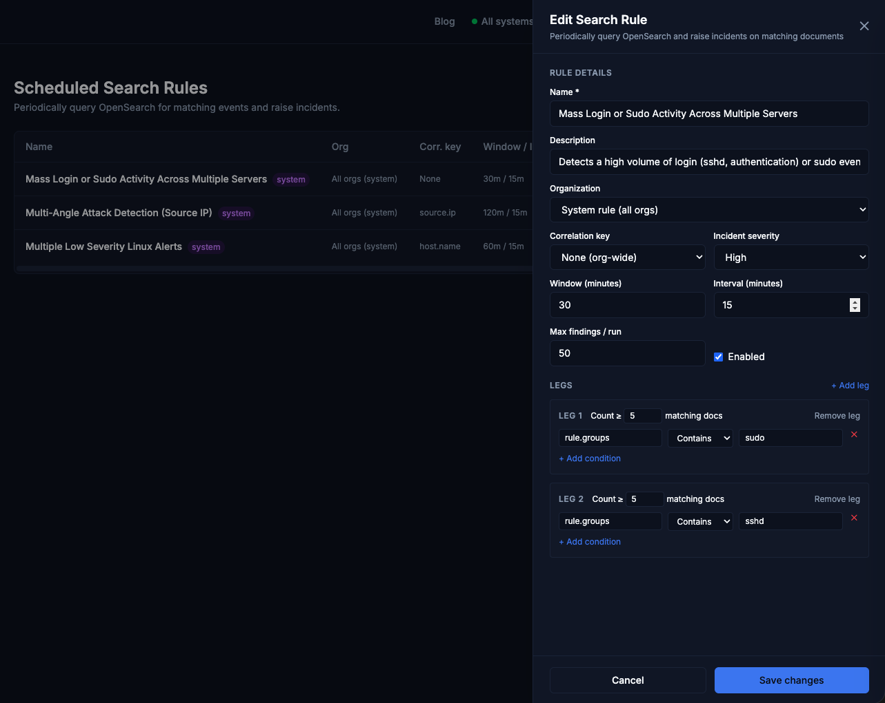

# Vels.online

**Vels.online** is an open-source Managed Security Service Provider (MSSP) platform. It gives security teams a unified workspace to monitor infrastructure, respond to incidents, manage vulnerabilities, publish services safely to the internet, and automate repetitive operational work — all from a single multi-tenant application.

The platform is built around a Wazuh-integrated SOC workflow: detections flow in from Wazuh agents (and other sources) as **Alerts**, get triaged (manually or by an LLM), and are worked to resolution through structured playbooks. Everything is scoped per organisation so an MSSP can manage multiple customers from one deployment.

---

## Screenshots

> _Screenshots coming soon._

| Dashboard | Incident Detail | Security Overview |
|-----------|----------------|------------------|
|  |  |  |

| Ingress Routes | Vulnerability Dashboard | Fleet / Agents |
|---------------|------------------------|----------------|
|  |  |  |

| Alert Inbox | Wazuh Active Response | Exception Rules |
|-------------|----------------------|-----------------|
|  |  |  |

| On-Call Calendar | On-Call Widget | |
|-----------------|----------------|--|
|  |  | |

| Correlation Rules | Detection Suggestions | Incident Assistant |
|-------------------|----------------------|--------------------|
|  |  |  |

| Scheduled Search Rules | Search Rule Author | |
|------------------------|-------------------|--|
|  |  | |

---

## Features

### Alert Ingestion Pipeline

A pre-incident layer that records every detection before it becomes an incident.

- **Alert inbox** — every external detection lands as an `AL-NNN` Alert record, visible at `/alerts/`, regardless of whether a matching incident already exists. No detection is silently discarded.
- **Smart auto-routing** — high and critical severity alerts with no matching open incident auto-promote to new incidents immediately; low and medium alerts sit in the inbox for analyst review.
- **Duplicate suppression** — incoming alerts are matched against open incidents by Wazuh rule ID or rule description within a configurable lookback window; matches auto-link to the existing incident instead of creating a duplicate.
- **Asset threshold promotion** — sustained low-severity alerts against the same asset within a configurable time window auto-promote to a new incident even when individual severities are low.
- **Bulk promote** — select multiple alerts from the inbox and promote them to a single incident in one action; a preview modal shows the auto-derived incident fields before writing.
- **Linked Alerts panel** — every incident shows a collapsible panel listing all `AL-NNN` records behind it, with state badges and timestamps.
- **Alert enrichment passthrough** — third-party tools (N8N, webhooks) can pass `title`, `description`, `severity`, `pap`, and `tlp` at ingestion time; promoted incidents inherit these values instead of auto-derived placeholders.
- **Source kinds** — alerts can be tagged as `wazuh`, `inbound_email`, `workflow`, `external_source`, or `scheduled_search` so the origin of every detection is visible and filterable.
- **Per-org thresholds** — configure the auto-promote count, time window, and match lookback window per organisation in settings.
- **Delete alert** — individual alerts can be removed from the inbox when they are noise or duplicates that should not be promoted.
- **Create correlation rule from selection** — select one or more alerts and open the rule-author assistant pre-seeded with those alerts as grounding context, turning a recurring signal into a permanent Correlation Rule in one step.

### Incident Management

A full lifecycle for security incidents, from detection to closure.

- **Multi-source ingestion** — incidents are created from Wazuh alerts, phishing emails, vulnerability scans, agent findings, or manually by analysts.
- **Severity tiers** — Critical · High · Medium · Low · Info, with SLA tracking displayed in the incident list. Severity auto-escalates when a new linked alert has a higher severity than the current incident.
- **Structured playbooks** — subject-based task templates automatically apply the right checklist (phishing, malware, vulnerability, etc.) when an incident is created.
- **Auto-assignment** — claiming an incident via "Start Work" automatically assigns it to you; the incident subject is also auto-populated from the LLM triage recommendation when one arrives.
- **Immutable audit trail** — every state change, comment, delegation, attachment, and alert link is timestamped in a timeline for complete accountability.
- **Extended close flow** — close incidents as resolved or as a duplicate linked to a canonical incident; a searchable combobox makes finding the canonical incident fast even across large lists.
- **Auto-closure** — incidents older than 7 days in `new`, `triaged`, or `resolved` state are automatically closed, keeping the active queue clean.
- **Delegation and transfers** — analysts can temporarily hand off work to teammates and receive it back, maintaining a clear chain of responsibility.
- **TLP/PAP-aware communications** — sensitive findings are gated by classification level so customers see exactly what they are entitled to see.
- **Persistent filter & sort preferences** — each user's chosen filters and sort order are remembered across sessions.
- **Tab counters** — incident detail tabs (Tasks, Contacts, IOCs, Assets, Attachments, Linked Alerts) show item counts at a glance.
- **Smart page refresh** — the incident detail page detects when new data is available (triage result, new alert link, comment) and prompts for a reload without forcing a full refresh.
- **Multi-organisation support** — each organisation has its own incident queue, team, and settings; admins can manage all orgs from one account.

### On-Call Scheduling

Manage 24/7 analyst coverage and automatically route post-triage incidents to the analyst on duty.

- **Shift blocks** — admins define named time blocks (e.g. Day / Evening / Night) that must collectively tile 00:00–24:00 without gaps or overlaps; the system validates full coverage before the template can be saved.
- **Repeating weekly rotation template** — assign a staff analyst to each day-of-week × shift-block slot; the template repeats indefinitely until explicitly changed, requiring no weekly manual input.
- **Shift overrides** — any analyst can initiate a shift swap (hand off their own upcoming shift) or offer to cover a colleague's shift; the receiving analyst accepts or declines via notification. A pending override does not affect the resolver until accepted, so there is never a coverage gap during the handoff process.
- **Hand-off now** — the active on-call analyst can transfer responsibility immediately from the calendar page without pre-planning a swap.
- **Pending requests panel** — outstanding swap and cover-offer requests are surfaced in a dedicated panel so recipients can action them without hunting through the calendar.
- **Post-triage incident routing** — after AI triage promotes an incident to `triaged`, the routing service automatically assigns it to the current on-call analyst. The routing mode is controlled via the `ONCALL_ROUTING` env var: `always` routes every triaged incident; `llm_guided` routes only when the triage recommendation is `escalate` or `assign_to_analyst`. If no on-call analyst is found, a system alert is sent to all staff.
- **Coverage gap detection** — the month calendar view renders days with no assigned analyst in red with a GAP badge so admins can fix gaps before they go live.
- **Timezone-aware display** — each staff analyst sets their local timezone in their profile (default: Europe/Amsterdam); all shift times in the UI are converted to the viewer's local timezone.
- **Compact on-call widget** — the incident list header shows who is currently on-call and when their shift ends, so analysts always know who owns incoming work without leaving their main workspace.
- **shift_swap notifications** — swap requests and cover offers trigger notifications via email, in-app, or push. At least one channel must remain enabled per analyst so coverage-critical requests are never missed.

### Alert Correlation Engine

Detect multi-step attack patterns from individually-unremarkable signals — without reading every raw alert.

- **ECS entity envelope** — every ingested alert carries a normalised ECS entity envelope (`host.name`, `source.ip`, `user.name`, `file.hash.sha256`, `process.name`). Values are canonicalised on ingest (case-folding, domain stripping) so cross-source entities join correctly. Stored in an indexed `AlertEntity` table for fast window joins.
- **Correlation Rules** — SOC-authored rules define one or more **Legs** (AND-ed field predicates) that must all be satisfied for the same **Correlation Key** value within a rolling **Window**. When every leg fires, the engine raises a single incident at a rule-defined severity with all matching alerts attached as evidence. Semantics are unordered co-occurrence (all-of-N, not a sequence).
- **Per-leg operators** — `equals`, `in [list]`, `contains`, severity `≥/≤`, and IP/CIDR match across alert fields, ECS entities, and selected Wazuh `source_ref` keys (`rule_id`, `rule_description`, `level`, `cve_id`).
- **Correlation keys** — bind legs by `host.name`, `source.ip`, `user.name`, or `none` (for absolute-count threshold rules that do not require a shared entity).
- **Dedup and re-linking** — at most one live firing per `(rule, entity_value)` while the incident is open. Subsequent matching alerts link into the existing incident; a new incident is only raised after the prior one closes.
- **Supersede** — when a correlation fires over alerts already promoted by the simpler fast-path, the engine relinks those alerts to the richer chain incident and marks the simpler incident as a duplicate. Active-work guard rail: incidents `in_progress` or actively assigned are never auto-superseded.
- **System rules** — rules with no org assignment apply as baseline detections to every tenant automatically; they are authored once by Vels SOC staff and propagate on the next evaluator run.
- **Per-org mutes** — admins can mute any system rule for a specific tenant from the Org Management UI. Muting stops that rule evaluating for the tenant only, without removing it globally.
- **LLM residual safety-net** — a periodic batch task reviews *residual* alerts (unlinked, past a settle delay) and groups related signals using the LLM into **Detection Suggestions**. Each suggestion shows the rationale, confidence score, and the contributing alerts.
- **Detection Suggestion review** — pending suggestions surface in the alert inbox. Accepting a suggestion promotes the grouped alerts into a new incident (entering the full IOC-enrichment and triage pipeline); dismissing removes it from the queue. Auto-creation defaults to off so the LLM never manufactures incidents without analyst approval.
- **Admin rule-builder UI** — a leg-builder drawer lets staff create and edit Correlation Rules visually: add legs, set field/operator/value per condition, choose the correlation key, window, severity, and enabled state. No code editing required.
- **Rule-author assistant** — describe a detection in plain language; the LLM drafts a Correlation Rule (legs, conditions, key, window, severity) grounded in the *actual* alert corpus for the chosen scope (a specific org or all orgs). The draft is pre-filled into the builder for review; the assistant never activates a rule.
- **Alert-grounded drafting** — before drafting, the assistant samples the real alert corpus (source kinds present, entity types, rule IDs and titles, severity mix) so proposed fields and values genuinely exist in the data.
- **Conversational refinement** — after the initial draft, analysts can iterate in a multi-turn chat to tighten conditions, change the correlation key, or adjust the window before saving.
- **Scope selection and ownership** — drafting for a specific org defaults the rule to an Org Rule; drafting against all orgs defaults to a System Rule.
- **Codify as rule** — a Detection Suggestion has a "Codify as rule" action that opens the rule-author assistant pre-seeded with the suggestion's context, turning a recurring LLM-flagged pattern into a permanent durable rule.
- **Create correlation rule from selected alerts** — select one or more alerts in the inbox and open the rule-author assistant pre-populated with those alerts as grounding context.

### Scheduled Search Rules

Pull-based detection over the full Wazuh OpenSearch data stream — without ingesting every event into the platform.

- **Pull model** — unlike the streaming engine, Scheduled Search Rules push their query *into* the Wazuh OpenSearch backend on a schedule. Only when the pattern is matched do the relevant documents get pulled in as **Findings** (materialised Alerts) and grouped into one Incident. The full Wazuh stream stays in OpenSearch.
- **Same leg/condition builder** — Scheduled Search Rules use the identical leg, condition, correlation key, and window model as Correlation Rules, so analysts learn one mental model for both engines.
- **Dynamic field catalog** — the platform pulls the live OpenSearch index mapping (TTL-cached) to populate field choices. Operators and values are validated against the real mapping so analysts cannot save a rule that references a non-existent or wrongly-typed field.
- **Multi-leg co-occurrence** — multi-leg rules require all legs satisfied for the same correlation-key value within the window; the evaluator uses per-leg `terms` aggregations and a Python join, keeping query cost bounded.
- **Schedule lifecycle** — each rule gets its own `django-celery-beat` `PeriodicTask` (minimum 5-minute cadence). The schedule is created, updated, or deleted automatically whenever the rule is saved or removed — no manual Celery configuration needed.
- **Run state inline** — the rules admin table shows each rule's last-run time, next-run time, and total run count so operators know the rule is healthy at a glance.
- **Run now** — a per-rule "Run now" button dispatches the evaluator immediately for ad-hoc testing without waiting for the schedule.
- **Run history** — each rule's run history (status, duration, errors) is accessible from the admin UI for debugging failing rules.
- **Dedup and idempotency** — `SearchFinding` records carry a unique `(rule, source_index, wazuh_doc_id)` key so re-runs over overlapping windows never materialise duplicate Alerts. A live-firing record per `(rule, entity_value)` ensures new Findings for the same key link into the open incident rather than spawning a new one.
- **Flood cap** — at most 50 Findings are materialised per run; if more documents match, an overflow note is added to the incident so operators are aware of the capped set.
- **Streaming suppression** — materialised search-alerts are excluded from the streaming correlation evaluator so the two engines never produce competing incidents from the same documents.
- **System rules and per-org fan-out** — system Scheduled Search Rules (no org) run for every tenant with each query scoped to that org's Wazuh agents. Tenants are always fully isolated; no cross-tenant correlation can occur.
- **Per-org failure isolation** — if one tenant's OpenSearch query fails during a system rule fan-out, the error is recorded and the remaining tenants continue running.
- **Per-org mutes** — admins can mute any system Scheduled Search Rule for a specific tenant, mirroring the Correlation Rule mute mechanism.
- **LLM-assisted author drawer** — a two-pass drafting flow: first the assistant fetches a menu of real Wazuh rule IDs and titles (from a live `rule.id` aggregation over OpenSearch) so analysts pick the relevant rules; then it expands those selections into a full leg-and-condition draft grounded in the actual Wazuh data — not synthetic guesses.
- **Mapping-aware sanitizer** — the LLM draft is validated against the live index mapping before it reaches the builder; invalid fields and operator/type mismatches are dropped with a warning rather than silently accepted.
- **`scheduled_search` source kind** — incidents raised by this engine are tagged with a distinct `source_kind` so they are filterable in the inbox and clearly distinguishable from push-based incidents.
- **IOC extraction and triage** — incidents created from Scheduled Search Rules pass through the same IOC enrichment and LLM triage pipeline as any other incident.

### Incident Assistant

An interactive AI panel embedded in the incident detail page for conversational investigation and action.

- **Propose-and-confirm panel** — analysts open a chat drawer on any incident and ask the assistant questions or request actions. The assistant proposes responses or changes; the analyst confirms before anything is written.
- **Create timeline comments** — the assistant can draft and post comments to the incident timeline, with the analyst reviewing the text before it is submitted.
- **Send contact messages** — the assistant can draft outbound messages to linked incident contacts (employees, asset owners), with the analyst confirming the recipient and content before the email is sent.
- **Incident context aware** — the assistant is grounded in the full incident context: title, description, severity, state, linked alerts, IOCs, assets, and timeline. Responses are relevant to the specific incident rather than generic.
- **Ollama and Gemini support** — the incident assistant respects the same pluggable LLM provider configuration (`ASSISTANT_LLM_PROVIDER`) as the rest of the platform, so it works with locally-hosted Ollama models as well as Google Gemini.
- **Grouped residual alert analysis** — the Ollama triage provider can group residual (unlinked) alerts and return a structured analysis, surfacing clusters of related signals the static engine did not catch.

### Inbound Phishing Ingestion

Turn phishing reports into incidents with zero analyst effort.

- Forward any suspected phishing email to `soc@vels.online`; the platform creates an incident automatically.
- Parses forwarded and attached `.eml` files; extracts raw email body as the incident description.
- Extracts URLs, domains, sender addresses, and email addresses as IOCs and enriches them immediately (see IOC Enrichment below).
- LLM triage annotates phishing incidents with email-specific context (sender reputation, URL risk, attachment analysis).
- **Contacts allow list** — known-safe senders (internal staff and registered contacts) are excluded from phishing incident creation to prevent analyst noise.
- **Auto-link forwarder as contact** — the user who forwarded the phishing email is automatically added as an `IncidentContact` on the created incident so they can be updated as the investigation progresses.
- **Forwarder as incident creator** — if the forwarding address matches a platform user record, that user is set as the incident's `created_by` so ownership is accurate rather than attributed to the IMAP poller.
- **Closure contact notifications** — when a phishing incident is closed, a notification email is sent to linked contacts. If the phishing email address can be identified as a drop address, a dedicated drop-confirmation email is sent.

### IOC Enrichment

Automatically assess every indicator of compromise at incident creation time.

- **IP addresses** — queried against AbuseIPDB; results include abuse confidence score, total reports, country, and usage type.
- **Domains and URLs** — queried against VirusTotal; malicious/suspicious vote counts surfaced inline.
- **Email addresses** — extracted from phishing emails and displayed as a dedicated IOC kind in the IOC tab.
- **Owned-asset deduplication** — IPs that belong to assets already registered in the organisation's estate are skipped at ingestion time so the IOC tab stays focused on external indicators.
- Enrichment data is available to the AI triage pipeline immediately, improving the quality of automated assessments.
- Enriched IOCs display threat intelligence details in the IOC tab without requiring analysts to leave the platform.

### AI-Powered Triage

Reduce analyst workload on repetitive alert screening.

- LLM analyses each incident (title, description, raw Wazuh event, linked assets, IOCs and their enrichment data) and returns a structured assessment: recommended severity, 2–3 sentence summary, primary and secondary suggested actions, and a false-positive confidence score.
- **Pluggable providers** — ships with Google Gemini and Ollama backends; swap via a single environment variable (`TRIAGE_LLM_PROVIDER`).
- **Per-org custom context** — admins can add organisation-specific prompt context (e.g. known safe IPs, environment notes) to sharpen triage accuracy for their estate.
- **Customisable LLM prompt** — org admins can edit the base triage prompt directly from the settings page to tune the model's behaviour for their environment.
- Triage results surface in the incident timeline as a labelled AI comment with recommended actions shown inline; analysts accept or override with one click.
- Triage status is prominently displayed on the incident detail page; a smart-reload banner appears the moment a triage result arrives.

### Fleet & Asset Management

Visibility into the devices and agents across your monitored estate.

- Wazuh agent sync runs on a daily schedule, automatically populating the Asset registry from the Wazuh API — no manual entry needed.
- **Permanent assets** — manually created or API-imported assets can be flagged as permanent so they are not removed by the automated expiry cleanup.
- Per-agent detail pages show status, OS, IP address, last keepalive, and linked incidents.
- Fleet events feed shows real-time activity across all agents.
- Assets can be manually added and assigned to Contacts (see below).

### Vulnerability Management

Track and remediate CVEs across the estate.

- **Vulnerability snapshots** — periodic counts of Critical/High/Medium/Low findings per organisation, trended over time on the vulnerability dashboard.
- **CVE advisories** — fetches remediation guidance from Ubuntu Security and Microsoft MSRC for CVEs found in the estate (Ubuntu and Windows platforms supported).
- **Work packages** — group related vulnerabilities into a tracked remediation effort with per-item status (Open · In Progress · Resolved · Accepted Risk).
- **Risk acceptance** — formally accept a CVE with a justification; accepted risks are surfaced separately and do not pollute the active queue.

### Exception Rules

Suppress known-good alerts so analysts focus on real threats.

- Create Wazuh exception rules from within the platform with a form-based UI (no XML editing required).
- Rules are assembled into valid Wazuh XML and pushed directly to a GitHub repository via the API; the Wazuh deployment picks them up on its next sync.
- IDs are allocated from a managed pool to avoid collisions; freed IDs are recycled automatically.
- Approval workflow: exceptions require review before the GitHub push is made.
- **Auto-update deployment config** — when a new exception file is pushed, the platform automatically updates the `apps-values.yaml` deployment manifest so the rule is included in the next Wazuh sync without manual config editing.
- **Automatic Wazuh restart** — ten minutes after a rule is pushed the platform triggers a rolling Wazuh manager restart so the new exception takes effect without requiring manual intervention.

### App Ingress (Reverse Proxy & WAF)

Let customers safely publish their own services to the internet without manual infrastructure work.

- **Self-service route management** — create ingress routes mapping a public FQDN to any backend host:port, scoped to the organisation.
- **Automatic SSL termination** — BunkerWeb provisions and renews Let's Encrypt certificates automatically; the creation form shows the DNS A-record target and a background check warns if DNS is not yet aligned.
- **Structured 7-tab settings UI** — the route settings panel is organised into dedicated tabs: General, WAF, IP Whitelist, Rate Limiting, Country, Bot Protection, and Advanced. Each tab has its own Save button with an unsaved-changes indicator dot and per-tab toast feedback.
- **General tab** — edit backend host, port, and protocol after creation; FQDN is displayed read-only.
- **Web Application Firewall** — ModSecurity with the OWASP Core Rule Set protects every route. Paranoia level (1–4) is shown as a segmented control with a description per level; HTTPS redirect can be toggled per route.
- **IP Whitelist** — add allowed IPs and CIDRs as a chip list with inline validation; capped at 10 entries with a clear limit message.
- **Rate limiting** — structured number + unit input (`r/s`, `r/m`, `r/h`) guards against traffic spikes and credential-stuffing.
- **Country access controls** — searchable multi-select popover lets operators block or allow countries by name rather than memorising ISO codes.
- **Bot protection** — toggle antibot challenge per route; choose the challenge type (cookie, JavaScript, reCAPTCHA, hCaptcha, Turnstile) with conditional credential fields per provider.
- **Advanced tab** — configure upstream proxy timeouts (connect, read, send), WebSocket proxying, proxy buffering, maximum request body size, allowed HTTP methods, real-IP extraction headers, and full CORS settings.
- **Blocked activity reports** — live feed of blocked requests (source IP, rule triggered, action taken) fetched on demand from BunkerWeb.
- Routes support both direct (public IP) and NetBird (overlay network) backend types.

### Automations

Trigger runbook-style workflows without leaving the platform.

- Automations map to Semaphore CI/CD templates; analysts can launch them from incident tasks with optional variable overrides.
- **Incident var mappings** — each automation can declare a YAML mapping from Semaphore playbook variable names to incident data sources (linked assets, IOCs, core incident fields). Variables are resolved automatically at run time — no manual copy-paste.
- **Pre-run preview modal** — before launching an automation, analysts see a preview of all resolved variables and can edit any value before confirming, so they can verify and adjust data without leaving the platform.
- **Auto-assign on start** — starting an automation task automatically assigns it to the analyst who clicked Start, creating a clear chain of responsibility.
- Task templates can be pre-wired to an automation so the right runbook fires automatically when a checklist item is started.
- In-progress automation status is tracked and surfaced on incident tasks in real time.
- **LLM-summarised output** — when an automation run completes, the platform feeds the raw output through the LLM and posts a concise summary as a task comment alongside the full output, reducing the need to parse verbose CI logs.
- **Wazuh response task type** — in addition to Semaphore automations, tasks can be of type `wazuh_response` to dispatch a Wazuh active response command directly from an incident checklist item (see Wazuh Active Response below).

### Wazuh Active Response

Take direct remediation actions on endpoints from within the platform — no context-switching to the Wazuh management interface.

- **Response catalog** — admins manage a global catalog of Wazuh active response commands (e.g. `firewall-drop`, `host-deny`). Each entry specifies supported OS platforms (`linux`, `windows`, `macos`), a default argument template with `{{incident.field}}` interpolation placeholders, a configurable timeout, and flags for security-overview visibility and destructive-action confirmation.
- **`wazuh_response` incident tasks** — task templates and ad-hoc checklist items can be wired to a catalog entry. The run modal shows an agent multi-picker (filtered to the response's supported platforms), pre-resolved argument values, a timeout field, and — for destructive commands — a required typed confirmation phrase (the agent hostname).
- **Variable interpolation** — `{{incident.id}}`, `{{asset.ip}}`, `{{ioc.ip}}`, `{{ioc.domain}}` and similar placeholders are resolved server-side before the modal opens; unresolvable placeholders remain editable so analysts can fill them in manually.
- **Auto-complete on dispatch** — once the Wazuh API accepts the command, the task is automatically marked done and a system comment is added to the incident timeline recording the command, target agents, arguments, timeout, and the analyst who dispatched it.
- **Security overview fast path** — active agent rows in the `/security` dashboard have a kebab menu showing catalog entries filtered to the agent's OS and flagged for security-overview use. Analysts can optionally link the execution to an existing incident; if linked, a task is created and the incident timeline is updated.
- **Agent response history** — the agent detail page has a dedicated Responses tab listing every `WazuhResponseExecution` for that host: timestamp, response name, executed by, args, timeout, linked incident, and Wazuh API status code.
- All active response executions are fire-and-forget (the Wazuh API queues the command on the agent); the timeline entry reflects dispatch, not confirmed execution.

### Incident Contacts

Link employees and asset owners to incidents for structured communication.

- **Contact directory** — per-organisation directory of natural persons (employees, contractors, asset owners) with name, email, job title, and department.
- **Asset ownership** — assign assets to contacts; when an incident is created and an asset is linked, the owner contact is automatically associated with the incident.
- **In-platform Q&A** — analysts can message a contact directly from an incident (role: `notified` or `questioned`); the platform sends the email and ingests replies back into the incident timeline via IMAP polling.
- **Threaded messaging** — outbound questions and inbound replies are displayed as a conversation thread within the incident detail.

### Notifications

Stay informed without polling.

- In-app notification centre for incident assignments, state changes, and comments.
- Web push notifications (VAPID) so analysts get notified even when the tab is not in focus.
- Per-user notification preferences to control which events trigger alerts.
- Email notifications with customisable templates.

### Status Page

A public-facing status page showing the health of the platform's own services, suitable for embedding or linking to from a customer portal.

### Blog / Knowledge Base

Built-in blog for publishing security advisories, runbook documentation, or customer-facing updates — managed from the admin panel.

### Multi-Organisation & Access Control

- Organisations are fully isolated; members only see their own data.
- Invitation flow with expiry for onboarding new team members.
- SSO via Authentik (OIDC) for production deployments; falls back to Django local auth for development.
- Role-based membership (admin vs. member) controls what each user can configure.

---

## Tech Stack

| Layer | Technology |
|-------|-----------|
| Backend | Django 5 · Django REST Framework · Celery · django-celery-beat |
| Database | PostgreSQL 16 |
| Cache / broker | Valkey (Redis-compatible) |
| Frontend | React 18 · Vite · Tailwind CSS · shadcn/ui |
| LLM providers | Google Gemini · Ollama (pluggable) |
| Security monitoring | Wazuh |
| Detection backend | Wazuh OpenSearch (Scheduled Search Rules pull engine) |
| Threat intelligence | AbuseIPDB · VirusTotal |
| WAF / reverse proxy | BunkerWeb (ModSecurity + OWASP CRS) |
| Automation runner | Semaphore CI |
| Identity provider | Authentik (OIDC) |
| Container runtime | Docker / Kubernetes (Helm chart included) |

---

## Getting Started

### Prerequisites

- Docker and Docker Compose
- A running Wazuh instance (optional for local dev)

### Run locally

```bash
git clone https://github.com/<your-org>/vels-online.git
cd vels-online
docker compose up --build
```

The backend will be available at `http://localhost:8000` and the frontend at `http://localhost:5173`.

Default admin credentials (local dev only): `admin` / `admin`.

### Environment variables

Copy `backend/.env.example` to `backend/.env` and fill in the values:

| Variable | Description |
|----------|-------------|
| `DATABASE_URL` | PostgreSQL connection string |
| `REDIS_URL` | Valkey/Redis connection string |
| `WAZUH_API_URL` | Wazuh manager API base URL |
| `WAZUH_API_USER` | Wazuh API username |
| `WAZUH_API_PASSWORD` | Wazuh API password |
| `TRIAGE_LLM_PROVIDER` | Dotted path to triage provider class (e.g. `incidents.llm.ollama.OllamaTriageProvider`) |
| `OLLAMA_BASE_URL` | Ollama server URL (if using Ollama provider) |
| `OLLAMA_MODEL` | Model name (e.g. `gemma4:31b-cloud`) |
| `GOOGLE_API_KEY` | Google API key (if using Gemini provider) |
| `AUTHENTIK_SERVER_URL` | Authentik OIDC server URL (leave blank to disable SSO) |
| `BUNKERWEB_API_URL` | BunkerWeb API URL (for ingress route management) |
| `SEMAPHORE_API_URL` | Semaphore API URL (for automation tasks) |
| `GITHUB_TOKEN` | GitHub PAT for pushing Wazuh exception rules |
| `ABUSEIPDB_API_KEY` | AbuseIPDB API key (for IOC enrichment) |
| `VIRUSTOTAL_API_KEY` | VirusTotal API key (for IOC enrichment) |
| `ONCALL_ROUTING` | Post-triage incident routing mode: `always` (default) routes every triaged incident; `llm_guided` routes only on escalation recommendations |
| `IMAP_HOST` | IMAP server host (for inbound contact replies and phishing ingestion) |
| `IMAP_USER` | IMAP account username |
| `IMAP_PASSWORD` | IMAP account password |
| `CORRELATION_LLM_PROVIDER` | Dotted path to LLM provider for the correlation rule-author assistant |
| `ASSISTANT_LLM_PROVIDER` | Dotted path to LLM provider for the incident assistant |
| `OPENSEARCH_URL` | Wazuh OpenSearch base URL (for Scheduled Search Rules and field-catalog queries) |
| `OPENSEARCH_USER` | OpenSearch username |
| `OPENSEARCH_PASSWORD` | OpenSearch password |

### Kubernetes / Helm

A Helm chart is provided under `deployment/`. See `deployment/values.yaml` for the full configuration reference.

---

## Project Structure

```
.
├── backend/              # Django application
│   ├── alerts/           # Alert ingestion pipeline, inbox, auto-routing, ECS entity envelope
│   ├── incidents/        # Incident lifecycle, tasks, LLM triage, incident assistant
│   ├── correlations/     # Correlation Rules, Scheduled Search Rules, Detection Suggestions, rule-author assistant
│   ├── security/         # Organisations, assets, vulnerabilities, CVE advisories
│   ├── exceptions/       # Wazuh exception rule management
│   ├── ingress/          # BunkerWeb-backed reverse proxy routes
│   ├── automations/      # Semaphore automations + Wazuh active response catalog and executions
│   ├── oncall/           # On-call scheduling, shift blocks, rotation templates, swap service, routing
│   ├── notifications/    # In-app, push, and email notifications
│   ├── inbound_mail/     # IMAP polling, phishing ingestion, contact reply handling
│   └── api/              # Cross-app API utilities
├── frontend/             # React + Vite SPA
│   └── src/
│       ├── pages/        # Route-level page components
│       ├── components/   # Shared UI components
│       └── context/      # React context (org selection, auth)
└── deployment/           # Helm chart and Kubernetes manifests
```

---

## Contributing

Pull requests are welcome. Please open an issue first to discuss significant changes.

---

## License

[MIT](LICENSE)
