# Vels.online

**Vels.online** is an open-source Managed Security Service Provider (MSSP) platform. It gives security teams a unified workspace to monitor infrastructure, respond to incidents, manage vulnerabilities, publish services safely to the internet, and automate repetitive operational work — all from a single multi-tenant application.

The platform is built around a Wazuh-integrated SOC workflow: detections flow in from Wazuh agents (and other sources) as **Alerts**, get triaged (manually or by an LLM), and are worked to resolution through structured playbooks. Everything is scoped per organisation so an MSSP can manage multiple customers from one deployment.

---

## Documentation

| | |
|---|---|
| 🚀 **[Getting Started](docs/getting-started.md)** | Run locally, environment variables, Kubernetes / Helm |
| 🏗️ **[Architecture](docs/architecture.md)** | How a detection becomes a closed incident · project structure |
| 📚 **[Feature docs](docs/features/)** | Deep-dive documentation for every capability |
| 🧭 **[Domain language](CONTEXT.md)** · **[ADRs](docs/adr/)** | The vocabulary and the decisions behind the design |
| 🔌 **[Alert ingestion API](docs/alert-ingest-contract.md)** | Contract for external integrators sending alerts in |

---

## Screenshots

> _Screenshots coming soon._

| Dashboard | Incident Detail | Security Overview |
|-----------|----------------|------------------|
| 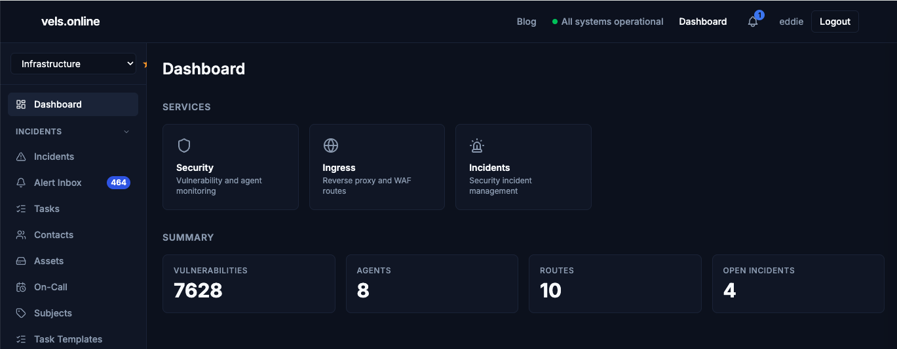 | 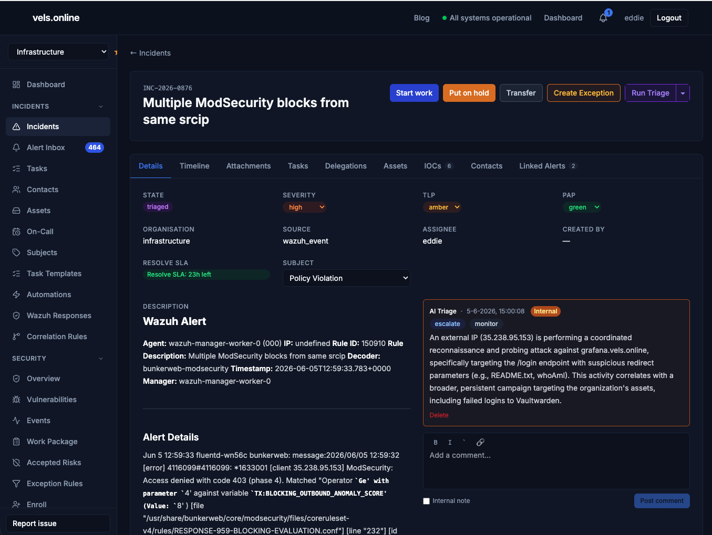 |  |

| Ingress Routes | Vulnerability Dashboard | Fleet / Agents |
|---------------|------------------------|----------------|
| 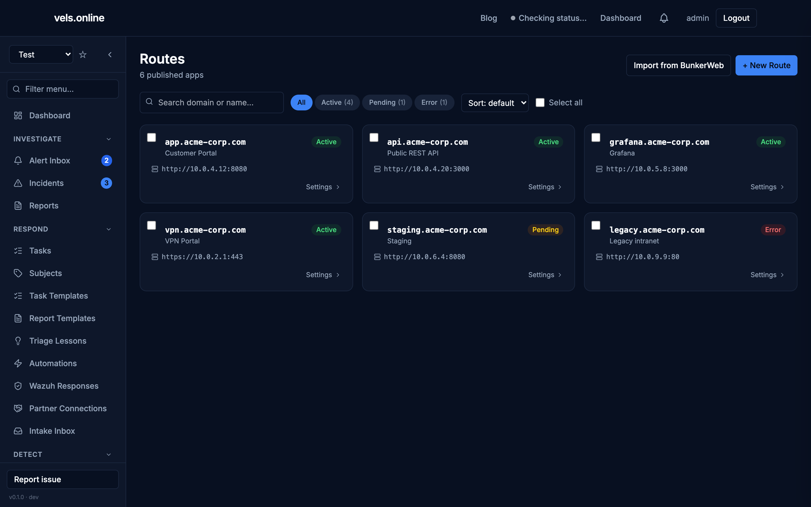 | 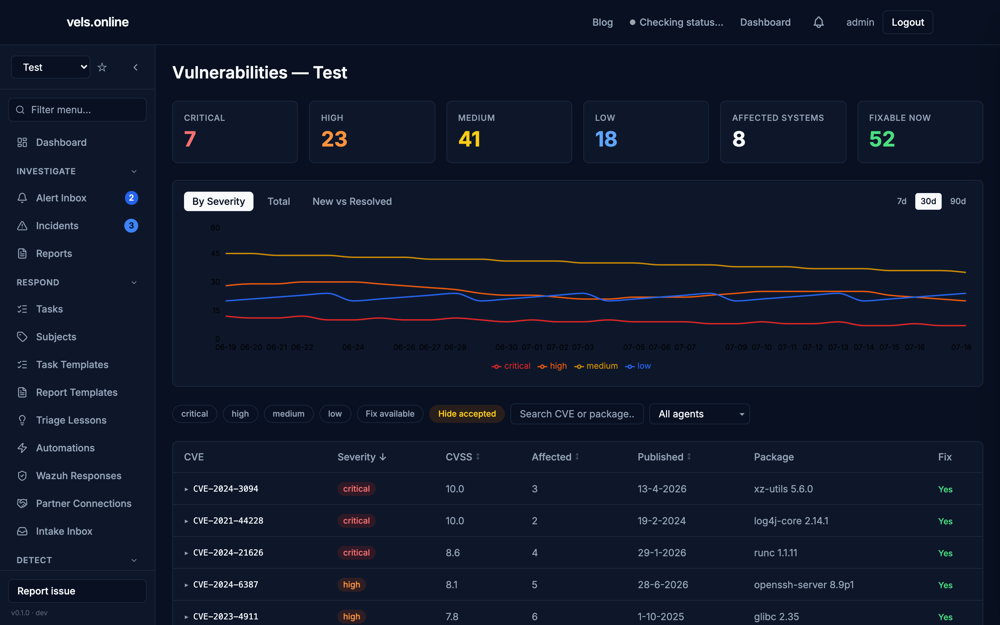 | 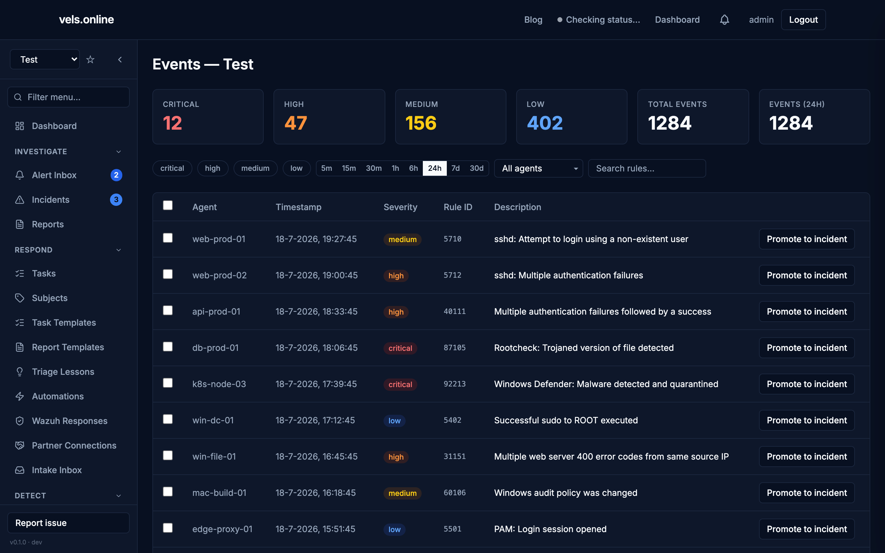 |

| Alert Inbox | Wazuh Active Response | Exception Rules |
|-------------|----------------------|-----------------|
| 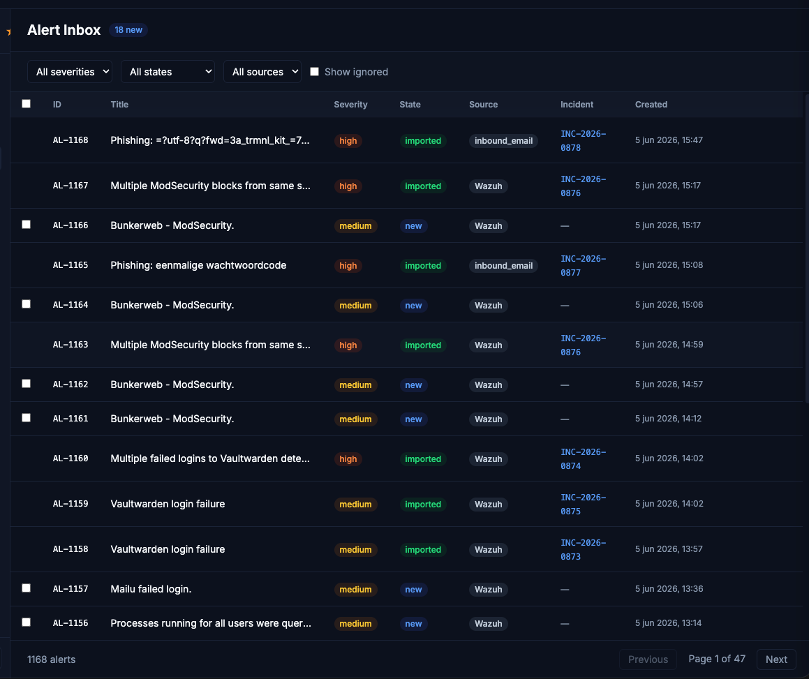 | 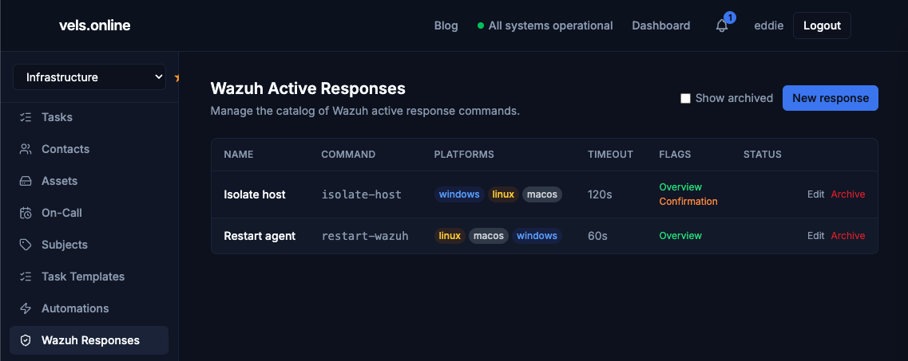 | 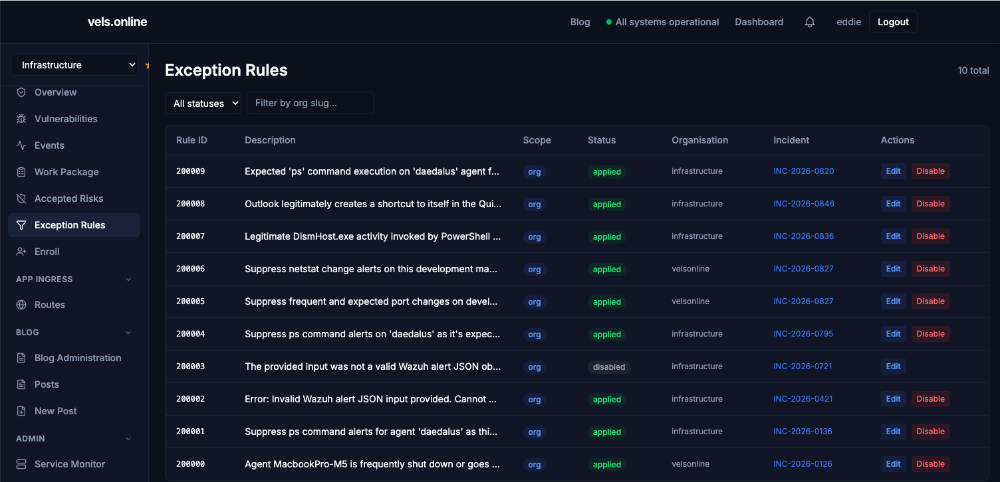 |

| On-Call Calendar | Correlation Rules | Threat Hunt Console |
|-----------------|-------------------|---------------------|
| 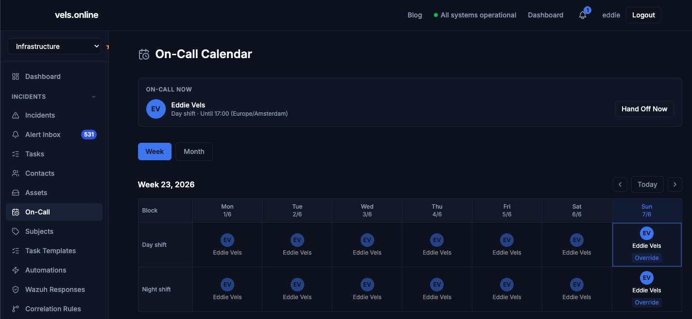 | 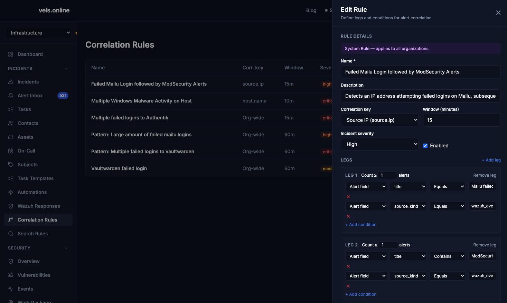 | 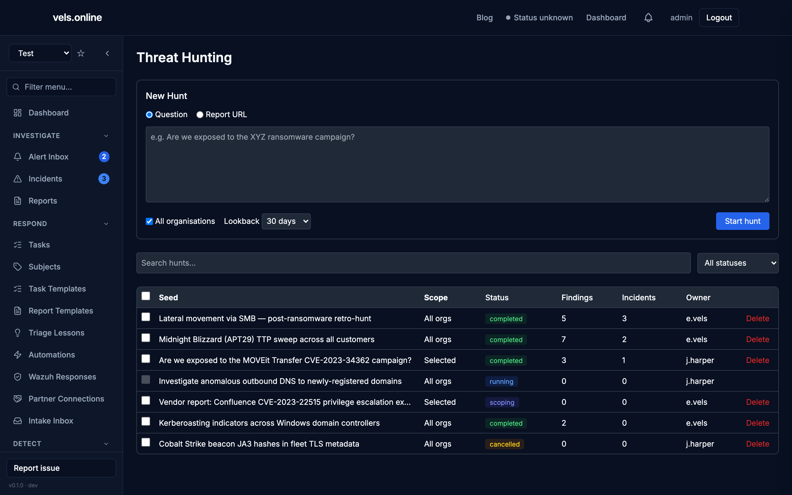 |

---

## What it does

Vels.online turns multi-source security signals into worked, closed incidents. Detections land as **Alerts**, the pipeline filters noise and correlates related signals, and the ones that matter become **Incidents** that flow through IOC enrichment, two-stage AI triage — a cheap classify plus a confidence-gated **Triage Agent** that works the playbook unattended — on-call routing, and an agentic Incident Assistant. Triage is **self-learning**: retrieved **Precedents** and distilled, staff-approved **Triage Lessons** carry the SOC's past dispositions forward, learned only from human-ratified outcomes. See the [architecture overview](docs/architecture.md) for the full picture.

Capabilities are documented in depth under **[docs/features](docs/features/)**:

- **[Detection & Correlation](docs/features/detection-and-correlation.md)** — the alert ingestion pipeline, the streaming correlation engine, pull-based Scheduled Search Rules over Wazuh OpenSearch, and detection-as-code Rule Tests.
- **[Incident Response](docs/features/incident-response.md)** — the incident lifecycle, real-time incident presence, on-call scheduling, two-stage AI triage with an unattended Triage Agent, self-learning triage (Precedents + distilled Triage Lessons), IOC enrichment, the Incident Assistant, cross-org Threat Hunting, leak-safe snapshot Reports, phishing ingestion, and incident contacts.
- **[Automation & Response](docs/features/automation-and-response.md)** — Semaphore automations, Wazuh active response, and Wazuh exception-rule management.
- **[Estate Management](docs/features/estate-management.md)** — fleet/asset visibility with derived internet-facing exposure, vulnerability management, and self-service ingress (reverse proxy & WAF).
- **[Platform](docs/features/platform.md)** — notifications, the staff Live Attack Map, responsive list conventions, status page, blog/knowledge base, and multi-organisation access control.

---

## Tech Stack

| Layer | Technology |
|-------|-----------|
| Backend | Django 5 · Django REST Framework · Celery · django-celery-beat |
| Database | PostgreSQL 16 |
| Cache / broker | Valkey (Redis-compatible) |
| Frontend | React 18 · Vite · Tailwind CSS · shadcn/ui |
| LLM providers | Google Gemini 3 · Ollama / Ollama Cloud (pluggable, with native web search) |
| Security monitoring | Wazuh |
| Detection backend | Wazuh OpenSearch (Scheduled Search Rules pull engine) |
| Threat intelligence | AbuseIPDB · VirusTotal |
| WAF / reverse proxy | BunkerWeb (ModSecurity + OWASP CRS) |
| Automation runner | Semaphore CI |
| Identity provider | Authentik (OIDC) |
| Container runtime | Docker / Kubernetes (Helm chart included) |

---

## Quick start

```bash
git clone https://github.com/<your-org>/vels-online.git
cd vels-online
docker compose up --build
```

Backend at `http://localhost:8000`, frontend at `http://localhost:5173` (local-dev admin: `admin` / `admin`). Full setup, environment variables, and Helm deployment are in **[Getting Started](docs/getting-started.md)**.

---

## Contributing

Pull requests are welcome. Please open an issue first to discuss significant changes.

---

## License

[MIT](LICENSE)
