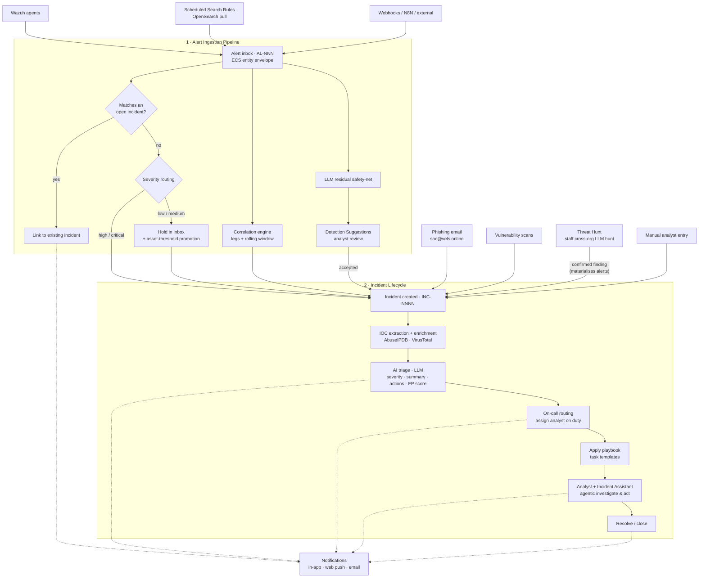

# Architecture

How data moves through Vels.online — from raw detection to closed incident — and where the code that does it lives. For the domain language behind these concepts, see [`CONTEXT.md`](../CONTEXT.md) and the decision records in [`docs/adr/`](adr/).

---

## How It Works

Everything in Vels.online flows through two stages: detections arrive as **Alerts** and are filtered in the **Alert Ingestion Pipeline**, and the ones that matter become **Incidents** that move through an automated **Incident Lifecycle** — IOC enrichment, AI triage, on-call routing, playbooks, and the Incident Assistant — with notifications firing at every meaningful step.



_Solid arrows show how data moves; dotted arrows show where notifications are sent._

**Walking through it:**

1. **Detections arrive.** Wazuh agents, Scheduled Search Rules (pulled from OpenSearch), webhooks, forwarded phishing email, vulnerability scans, staff-driven Threat Hunts, and manual entry all feed the platform. Push-based detections land in the **Alert inbox** as `AL-NNN` records, each carrying a normalised ECS entity envelope; phishing email, vulnerability scans, confirmed Threat Hunt findings, and manual reports open an incident directly.
2. **The pipeline filters noise.** Each new alert is checked against open incidents — a match **links** in instead of creating a duplicate. Unmatched alerts are routed by severity: **high/critical auto-promote** to a new incident; **low/medium wait** in the inbox until an analyst acts or an asset-threshold promotion fires. In parallel, the **correlation engine** raises an incident when multiple alerts satisfy a rule's legs within its window, and an **LLM residual safety-net** groups leftover signals into **Detection Suggestions** for analyst review.
3. **An incident is created.** However it was raised, the incident enters the same lifecycle: **IOC enrichment** scores indicators against AbuseIPDB and VirusTotal, then **AI triage** has the LLM recommend a severity, write a summary, suggest actions, and score false-positive likelihood.
4. **It reaches the right analyst.** **On-call routing** assigns the triaged incident to whoever is on duty, and the matching **playbook** applies its task-template checklist automatically.
5. **The analyst works it — with help.** The **Incident Assistant** runs an agentic loop alongside the analyst: it investigates (related incidents, alerts, assets, live web search), auto-executes safe internal actions, works manual tasks, and proposes anything consequential for one-click confirmation — until the incident is resolved or closed.
6. **Notifications keep everyone informed.** In-app, web-push, and email notifications fire on assignment, triage results, state changes, and closure, so no one has to poll for updates.

For the detail behind each stage, see the [feature docs](features/).

---

## Project Structure

```
.
├── backend/              # Django application
│   ├── alerts/           # Alert ingestion pipeline, inbox, auto-routing, ECS entity envelope
│   ├── incidents/        # Incident lifecycle, tasks, LLM triage
│   ├── assistants/       # Agentic tool-calling loop, providers, web search (shared by incident assistant + hunts)
│   ├── hunts/            # Threat Hunting module: Hunt aggregate, scoping, lenses, SSRF fetcher, finding→incident grouping
│   ├── correlations/     # Correlation Rules, Scheduled Search Rules, Detection Suggestions, rule-author assistant
│   ├── security/         # Organisations (incl. Infrastructure pseudo-org), assets, vulnerabilities, CVE advisories
│   ├── exceptions/       # Wazuh exception rule management
│   ├── ingress/          # BunkerWeb-backed reverse proxy routes
│   ├── automations/      # Semaphore automations + Wazuh active response catalog and executions
│   ├── oncall/           # On-call scheduling, shift blocks, rotation templates, swap service, routing
│   ├── contacts/         # Incident contact directory and threaded messaging
│   ├── notifications/    # In-app, push, and email notifications
│   ├── inbound_mail/     # IMAP polling, phishing ingestion, contact reply handling
│   └── api/              # Cross-app API utilities
├── frontend/             # React + Vite SPA
│   └── src/
│       ├── pages/        # Route-level page components
│       ├── components/   # Shared UI components
│       └── context/      # React context (org selection, auth)
└── deployment/           # Helm chart and Kubernetes manifests
```
